# React Flow Showcase

這個 Side Project 主要是為了展示我對 React 和 TypeScript 的熟練度。使用了 @xyflow/react 12.0.0-next.24 的 beta 版本，並利用其提供的新 types 和 hooks，展現我對新工具的掌握能力。

This side project showcases how I familiarize myself with React and TypeScript, utilizing the 12 beta version of @xyflow/react 12.0.0-next.24 with its new types and hooks to demonstrate my capability with new tools.

### Project Highlights

- Problem-Solving Expertise
  Throughout the development of this project, I frequently referred to GitHub issues and discussions, Discord channels, and official documentation. Given the beta version's lack of official documentation, I also navigated through the source code to understand and implement new features. This involved:

- Identifying Solutions: Efficiently navigating through GitHub issues, Discord channels, official docs, and source code to find solutions to common and uncommon problems.
- Community Engagement: Participating in discussions on GitHub and Discord to gain insights and contribute to problem-solving.
- Staying Updated: Keeping up with the latest updates and best practices shared within the GitHub community, Discord developer groups, and official documentation.

### Frontend Development Skills

As a frontend developer, this project allowed me to:

- Showcase Technical Proficiency: Implement complex features using React and TypeScript with a strong understanding of component-based architecture.
- Leverage Advanced Tools: Utilize advanced tools and libraries such as React Flow for dynamic, interactive UI elements.
- Optimize Performance: Focus on performance optimization and best practices to ensure smooth and efficient user experiences.

### Key Features

- React Flow Integration: Implemented a sophisticated flowchart with dynamic node connections, showcasing advanced usage of React Flow.
- TypeScript Mastery: Demonstrated deep understanding of TypeScript for type safety and better code maintainability.
- Modern UI/UX: Developed a modern, user-friendly interface using Tailwind CSS for responsive design.

### Why This Project Stands Out

- Innovation: Leveraged the latest beta tools and libraries, reflecting my proactive approach to adopting new technologies.
- Problem-Solving: Highlighted my ability to effectively troubleshoot and resolve issues by actively engaging with the developer community on GitHub and Discord, consulting official documentation, and navigating source code.
- Technical Depth: Showcased my in-depth knowledge and application of React and TypeScript in a real-world scenario.

### Installation

Follow these steps to set up and run the project locally:

### Prerequisites

- Node.js (version 14 or later)
- pnpm

### Install Dependencies

Using pnpm:

```bash
pnpm install
```

### Running the Development Server

To start the development server, run:

Using pnpm:

```bash
pnpm dev
```

### Project Structure

    .
    ├── public
    ├── src
        ├── component
        ├── edges
        ├── helper
        ├── hooks
        ├── nodes
        ├── store
        ├── types
        ├── utils
    ├── App.tsx
    ├── flow.tsx
    ├── index.css
    ├── main.tsx
    └── vite-env.d.ts

### Dependencies

#### Main Dependencies

- [React](https://reactjs.org/) - A JavaScript library for building user interfaces.
- [React DOM](https://reactjs.org/docs/react-dom.html) - Serves as the entry point to the DOM and server renderers for React.
- [@xyflow/react](https://reactflow.dev/) - A library for building node-based editors and diagrams.
- [immer](https://immerjs.github.io/immer/docs/introduction) - A library for working with immutable state in JavaScript.
- [zustand](https://zustand.surge.sh/) - A small, fast, and scalable bearbones state-management solution.

#### Development Dependencies

- [TypeScript](https://www.typescriptlang.org/) - A strongly typed programming language that builds on JavaScript.
- [Vite](https://vitejs.dev/) - A next-generation front-end tooling.
- [Tailwind CSS](https://tailwindcss.com/) - A utility-first CSS framework.
- [ESLint](https://eslint.org/) - A tool for identifying and reporting on patterns found in ECMAScript/JavaScript code.
- [clsx](https://github.com/lukeed/clsx) - A utility for constructing `className` strings conditionally.

```mermaid
flowchart TD
    %% Bootstrap Layer
    subgraph "Bootstrap"
        A("index.html"):::bootstrap
        B("main.tsx"):::bootstrap
        A --> B
    end

    %% Main Container
    C("App.tsx"):::ui
    B --> C

    %% React Flow Integration
    subgraph "Flow Editor"
        D("flow.tsx"):::ui
    end
    C --> D

    %% UI Components Subgraph
    subgraph "UI Components"
        AC("GithubLink"):::components
        AD("InputField"):::components
        AE("Sidebar"):::components
    end
    C --> AC
    C --> AD
    C --> AE

    %% Custom Nodes Subgraph
    subgraph "Custom Nodes"
        E("Extra Charge Node"):::nodes
        F("Product Info Node"):::nodes
        G("Total Price Node"):::nodes
    end
    D --> E
    D --> F
    D --> G

    %% Custom Edges Subgraph
    subgraph "Custom Edges"
        H("Default Edge"):::edges
        I("Product to Total Edge"):::edges
    end
    D --> H
    D --> I

    %% Business Logic Subgraph
    subgraph "Business Logic"
        %% Helpers Subgroup
        subgraph "Helpers"
            J("calculateFinalAmount"):::helpers
            K("calculateSubtotal"):::helpers
            L("calculateTotalSubtotal"):::helpers
        end
        %% Constants Subgroup
        subgraph "Constants"
            M("Links Config"):::constants
            N("Local Storage Keys"):::constants
        end
    end
    %% Link Custom Nodes to Helpers (illustrating business logic triggered by nodes)
    E --> J
    F --> K
    G --> L
    %% Link Helpers to Constants
    J --> M
    L --> N

    %% Custom Hooks Subgraph
    subgraph "Custom Hooks"
        O("useCustomNodesChange"):::hooks
        P("useExtraChargeConnections"):::hooks
        Q("useLocalNodesHandlers"):::hooks
        R("useProductInfoConnections"):::hooks
        S("useStorageEventListener"):::hooks
    end
    %% Hooks interact with nodes/edges and UI
    O --> E
    P --> H
    Q --> G
    R --> F
    S --> AD

    %% Utilities Subgraph
    subgraph "Utilities"
        %% Utility Functions
        subgraph "Utility Functions"
            T("createNodeId"):::utils
        end
        %% Type Definitions
        subgraph "Type Definitions"
            U("genericTypes"):::utils
            V("initialDataTypes"):::utils
            W("nodeInterfaces"):::utils
        end
    end
    %% Sample interaction from hooks to utilities
    O --> U

    %% External Dependencies
    subgraph "External Dependencies"
        X("React"):::external
        Y("TypeScript"):::external
        Z("React Flow (@xyflow/react)"):::external
        AA("Tailwind CSS"):::external
        AB("Vite"):::external
    end
    %% External libraries used by bootstrap and main container
    C --- X
    C --- Y
    D --- Z
    C --- AA
    B --- AB

    %% Click Events
    click A "https://github.com/eryet/react-flow-showcase/blob/main/index.html"
    click B "https://github.com/eryet/react-flow-showcase/blob/main/src/main.tsx"
    click C "https://github.com/eryet/react-flow-showcase/blob/main/src/App.tsx"
    click D "https://github.com/eryet/react-flow-showcase/blob/main/src/flow.tsx"
    click E "https://github.com/eryet/react-flow-showcase/blob/main/src/nodes/ExtraChargeNode.tsx"
    click F "https://github.com/eryet/react-flow-showcase/blob/main/src/nodes/ProductInfoNode.tsx"
    click G "https://github.com/eryet/react-flow-showcase/blob/main/src/nodes/TotalPriceNode.tsx"
    click H "https://github.com/eryet/react-flow-showcase/blob/main/src/edges/DefaultEdge.tsx"
    click I "https://github.com/eryet/react-flow-showcase/blob/main/src/edges/ProductToTotalEdge.tsx"
    click J "https://github.com/eryet/react-flow-showcase/blob/main/src/helper/calculateFinalAmount.ts"
    click K "https://github.com/eryet/react-flow-showcase/blob/main/src/helper/calculateSubtotal.ts"
    click L "https://github.com/eryet/react-flow-showcase/blob/main/src/helper/calculateTotalSubtotal.ts"
    click M "https://github.com/eryet/react-flow-showcase/blob/main/src/const/links.ts"
    click N "https://github.com/eryet/react-flow-showcase/blob/main/src/const/localStorageKey.ts"
    click O "https://github.com/eryet/react-flow-showcase/blob/main/src/hooks/useCustomNodesChange.ts"
    click P "https://github.com/eryet/react-flow-showcase/blob/main/src/hooks/useExtraChargeConnections.ts"
    click Q "https://github.com/eryet/react-flow-showcase/blob/main/src/hooks/useLocalNodesHandlers.ts"
    click R "https://github.com/eryet/react-flow-showcase/blob/main/src/hooks/useProductInfoConnections.ts"
    click S "https://github.com/eryet/react-flow-showcase/blob/main/src/hooks/useStorageEventListener.ts"
    click T "https://github.com/eryet/react-flow-showcase/blob/main/src/utils/createNodeId.ts"
    click U "https://github.com/eryet/react-flow-showcase/blob/main/src/types/genericTypes.ts"
    click V "https://github.com/eryet/react-flow-showcase/blob/main/src/types/initialDataTypes.ts"
    click W "https://github.com/eryet/react-flow-showcase/blob/main/src/types/nodeInterfaces.ts"
    click AC "https://github.com/eryet/react-flow-showcase/blob/main/src/component/GithubLink.tsx"
    click AD "https://github.com/eryet/react-flow-showcase/blob/main/src/component/InputField.tsx"
    click AE "https://github.com/eryet/react-flow-showcase/blob/main/src/component/Sidebar.tsx"

    %% Styles
    classDef bootstrap fill:#B3E5FC,stroke:#0288D1,stroke-width:2px;
    classDef ui fill:#81D4FA,stroke:#01579B,stroke-width:2px;
    classDef nodes fill:#FFECB3,stroke:#FF9800,stroke-width:2px;
    classDef edges fill:#FFE0B2,stroke:#FB8C00,stroke-width:2px;
    classDef helpers fill:#FFF9C4,stroke:#FBC02D,stroke-width:2px;
    classDef constants fill:#FFCC80,stroke:#FFB300,stroke-width:2px;
    classDef hooks fill:#C8E6C9,stroke:#388E3C,stroke-width:2px;
    classDef utils fill:#D1C4E9,stroke:#7E57C2,stroke-width:2px;
    classDef components fill:#E1BEE7,stroke:#8E24AA,stroke-width:2px;
    classDef external fill:#CFD8DC,stroke:#607D8B,stroke-width:2px;
```


